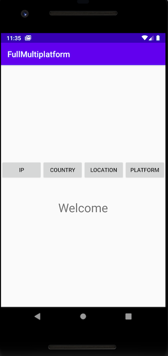
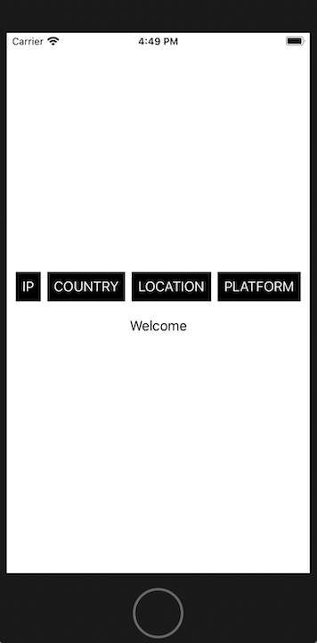

Full Multiplatform Project
==========

This project is an example to demonstrate how to write a CLEAN Kotlin Multiplatform Project (Android & iPhone) using the basics.

I've made a very simple application with 1 screen, 1 presenter, 4 usecases, 1 repository and 2 datasources. I've also included dependency injection, platform dependent code and connections to a public API.

---

**Architecture**: MVP

**Kotlin**: Version 1.4.21

**Gradle**: Version 6.8 with Kotlin DSL (kts files)

**Dependency Injection**: PopKorn 2.1.0 ([link][1])

**Serialization**: Kotlinx Serialization 1.0.1 ([link][2])

**Coroutines**: Version 1.4.2-native-mt ([link][3])

**Connections**: KTor 1.5.0 ([link][4])

---

 

License
-------

    Copyright 2020 Pau Corbella

    Licensed under the Apache License, Version 2.0 (the "License");
    you may not use this file except in compliance with the License.
    You may obtain a copy of the License at

       http://www.apache.org/licenses/LICENSE-2.0

    Unless required by applicable law or agreed to in writing, software
    distributed under the License is distributed on an "AS IS" BASIS,
    WITHOUT WARRANTIES OR CONDITIONS OF ANY KIND, either express or implied.
    See the License for the specific language governing permissions and
    limitations under the License.
    
[1]: https://github.com/corbella83/PopKorn
[2]: https://github.com/Kotlin/kotlinx.serialization
[3]: https://github.com/Kotlin/kotlinx.coroutines
[4]: https://github.com/ktorio/ktor